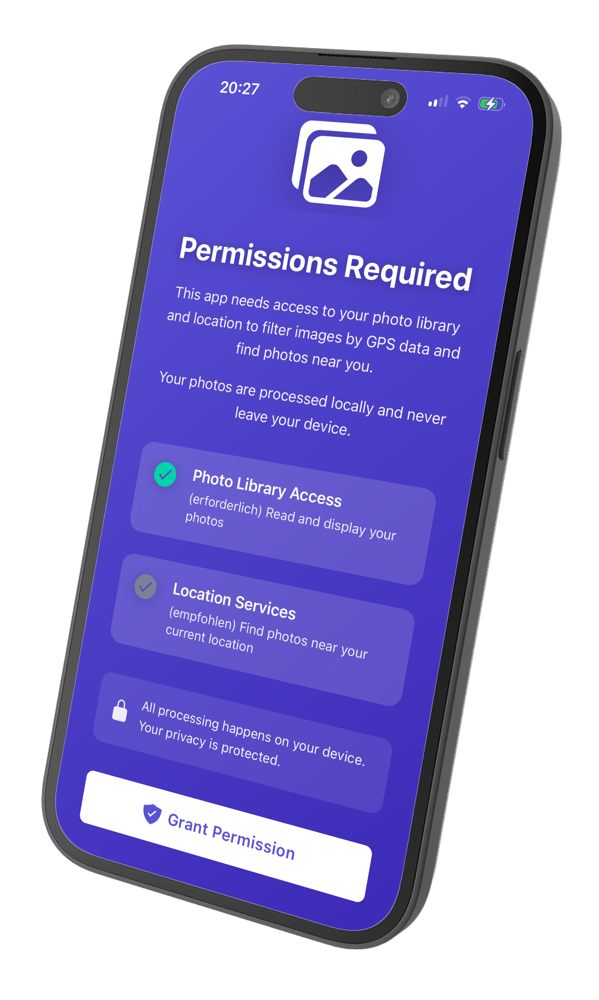
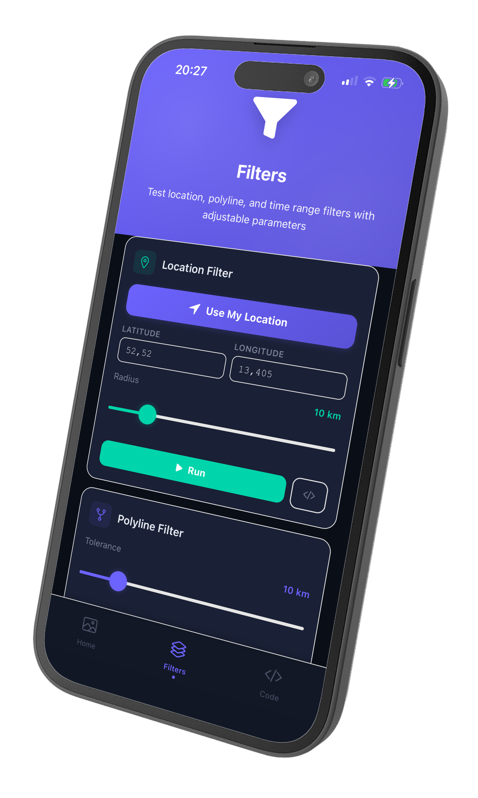
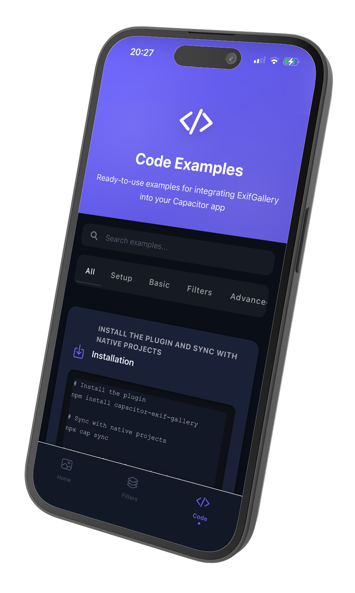

# Exif Gallery for Capacitor

A Capacitor plugin for filtering and picking images by GPS location, route polylines, and time range using EXIF metadata. The native iOS & Android image picker that turns massive photo libraries into precisely filtered galleries — perfect for travel apps, photo journals, event documentation, and any application that needs smart image selection based on where and when photos were taken.

[](https://www.npmjs.com/package/@kesbyte/capacitor-exif-gallery)
[](https://www.npmjs.com/package/@kesbyte/capacitor-exif-gallery)
[](https://plugins.kesbyte-digital.com/exif-gallery)
[](https://capacitorjs.com)
[]()
[](https://docs.npmjs.com/generating-provenance-statements)

## Why Exif Gallery?

The standard `@capacitor/camera` plugin lets users pick photos — but it can't
filter them. Exif Gallery adds native GPS and time-based filtering *before*
the user selects images:

| Feature                        | @capacitor/camera | @capacitor-community/media | Exif Gallery |
|--------------------------------|:-----------------:|:--------------------------:|:------------:|
| Pick images from gallery       | ✅                | ✅                         | ✅           |
| Read EXIF metadata             | Partial           | ❌                         | ✅           |
| Filter by GPS location         | ❌                | ❌                         | ✅           |
| Filter by time range           | ❌                | ❌                         | ✅           |
| Route/polyline corridor filter | ❌                | ❌                         | ✅           |
| Multi-language native UI       | ❌                | ❌                         | ✅           |
| Intelligent fallback logic     | ❌                | ❌                         | ✅           |

## At a Glance

- ✅ Filter photos by GPS radius or route polyline
- ✅ Filter by date/time range
- ✅ Combine location + time filters (AND logic)
- ✅ Extract EXIF metadata (GPS, timestamps)
- ✅ Intelligent fallback when too few results
- ✅ Native UI in English, German, French, Spanish
- ✅ Custom UI text overrides
- ✅ iOS 15+ & Android 7.0+ (API 24)
- ✅ Capacitor 8 compatible
- ✅ Free for debug builds — license required for production

## Sample App

A complete working example is available in the source repository at `/sample-app`. This Ionic Angular application demonstrates:

- Interactive location and time filtering
- Route-based image filtering using polylines
- EXIF metadata display
- Multi-language UI
- Real-world integration patterns

<p align="center">
  
  
  
</p>

### Running the Sample App

```bash
git clone https://github.com/KesByte-Digital/capacitor-exif-gallery.git
cd capacitor-exif-gallery/sample-app
npm install
npx cap sync

# Run on iOS
ionic cap run ios

# Run on Android
ionic cap run android
```

**Note:** The sample app demonstrates plugin functionality and is available in the [GitHub repository](https://github.com/KesByte-Digital/capacitor-exif-gallery). It is not included in the npm package.

## Key Features

- **Location-based filtering** - Filter images within a geographic radius using GPS EXIF data
- **Encoded polyline support** - Use Google Maps polyline format for route-based filtering
- **Time range filtering** - Select images taken within a specific date/time range
- **Combined filters** - Apply location AND time filters simultaneously
- **EXIF metadata extraction** - Access GPS coordinates and timestamps from selected images
- **Intelligent fallback** - Automatically switches to time-based filtering if location results are too few
- **Multi-language UI** - Built-in support for English, German, French, and Spanish
- **Automatic permissions** - Handles photo library and location permission requests seamlessly
- **Custom UI text** - Override default labels and messages in any language

## Platform Support

- **iOS:** 15.0+ (Swift)
- **Android:** 7.0+ (API 24+, Kotlin)

## Quick Start

### 1. Install

```bash
npm install @kesbyte/capacitor-exif-gallery
npx cap sync
```

### 2. Configure License Key (Production Only)

**⚠️ Required for production builds only** - Debug builds work without a license for testing.

Purchase your license key at **[plugins.kesbyte-digital.com/exif-gallery](https://plugins.kesbyte-digital.com/exif-gallery)**, then add it to your app configuration:

#### iOS Configuration (Info.plist)

Open your `ios/App/App/Info.plist` and add:

```xml
<key>KBExifGalleryLicense</key>
<string>YOUR_LICENSE_KEY_HERE</string>
```

#### Android Configuration (AndroidManifest.xml)

Open your `android/app/src/main/AndroidManifest.xml` and add inside the `<application>` tag:

```xml
<application>
    <!-- Other configuration... -->

    <meta-data
        android:name="com.kesbytedigital.exifgallery.LICENSE_KEY"
        android:value="YOUR_LICENSE_KEY_HERE" />

</application>
```

#### Validation Behavior

- **Debug Builds:** License validation is skipped - full functionality available for testing
- **Production Builds:** License is validated when `pick()` is called
  - ✅ Valid license: Gallery opens normally
  - ❌ Invalid/missing license: `pick()` throws an error immediately
  - Error codes: `LICENSE_MISSING`, `LICENSE_INVALID`, `LICENSE_BUNDLE_MISMATCH`

**Note:** The license is validated at the moment you call `pick()`, not during `initialize()`. This ensures fast app startup while still enforcing licensing before the plugin is actually used.

#### Troubleshooting

**"License key not found" error:**
- Verify the key name matches exactly: `KBExifGalleryLicense` (iOS) or `com.kesbytedigital.exifgallery.LICENSE_KEY` (Android)
- Ensure you ran `npx cap sync` after adding the license
- Check that the license key has no extra whitespace or line breaks

**"Bundle ID mismatch" error:**
- Your license is tied to a specific bundle ID (e.g., `com.example.myapp`)
- Verify your app's bundle ID matches the license
- iOS: Check `CFBundleIdentifier` in Info.plist
- Android: Check `applicationId` in `build.gradle`

### 3. Configure Permissions

#### iOS Permissions (Info.plist)

Add the following to your `ios/App/App/Info.plist`:

```xml
<key>NSPhotoLibraryUsageDescription</key>
<string>This app needs access to your photo library to filter and select images</string>

<key>NSLocationWhenInUseUsageDescription</key>
<string>This app uses your location to enhance image filtering capabilities</string>
```

**Permission Details:**
- `NSPhotoLibraryUsageDescription`: Required for reading photos from the library
- `NSLocationWhenInUseUsageDescription`: Required for location-based filtering (only when app is in use)

#### Android Permissions (AndroidManifest.xml)

Add the following to your `android/app/src/main/AndroidManifest.xml`:

```xml
<!-- Photo Library Permissions -->
<uses-permission android:name="android.permission.READ_MEDIA_IMAGES" />
<uses-permission android:name="android.permission.READ_EXTERNAL_STORAGE" android:maxSdkVersion="32" />

<!-- Location Permission -->
<uses-permission android:name="android.permission.ACCESS_FINE_LOCATION" />
```

**Permission Details:**
- `READ_MEDIA_IMAGES`: For Android 13+ (API 33+), granular image access
- `READ_EXTERNAL_STORAGE`: For Android 12 and below (API ≤32), legacy storage access
- `ACCESS_FINE_LOCATION`: Required for location-based filtering

### 4. Initialize (once at app startup)

```typescript
import { ExifGallery } from '@kesbyte/capacitor-exif-gallery';

// During app initialization
await ExifGallery.initialize();
```

### 5. Open gallery with filters

```typescript
const result = await ExifGallery.pick({
  filter: {
    location: {
      coordinates: [{ lat: 52.52, lng: 13.40 }],
      radius: 5000  // 5km radius
    }
  }
});

// Access selected images
if (!result.cancelled) {
  result.images.forEach(image => {
    console.log(`Selected: ${image.uri}`);
    console.log(`Location: ${image.exif?.lat}, ${image.exif?.lng}`);
    console.log(`Timestamp: ${image.exif?.timestamp}`);
  });
}
```

## Features in Detail

### Location-Based Filtering

Filter images by geographic location with two flexible input formats.

**Using coordinates:**
```typescript
const result = await ExifGallery.pick({
  filter: {
    location: {
      coordinates: [
        { lat: 52.5163, lng: 13.3777 },  // Berlin
        { lat: 48.1374, lng: 11.5755 }   // Munich
      ],
      radius: 10000  // 10km around each point
    }
  }
});
```

**Using encoded polylines (Google Maps format):**
```typescript
// Get polyline from Google Directions API
const directionsResult = await fetch(
  'https://maps.googleapis.com/maps/api/directions/json?' +
  'origin=Berlin&destination=Munich&key=YOUR_API_KEY'
);
const route = directionsResult.routes[0].overview_polyline.points;

const result = await ExifGallery.pick({
  filter: {
    location: {
      polyline: route,  // Encoded string like "_p~iF~ps|U_ulLnnqC"
      radius: 5000     // 5km corridor around route
    }
  }
});
```

**Why encoded polylines?**
- 92% smaller payload (5KB → 400 bytes for 100 points)
- URL-safe format
- Direct compatibility with Google Maps, Mapbox, OpenStreetMap

### Time Range Filtering

Select images taken within a specific date/time window.

```typescript
const result = await ExifGallery.pick({
  filter: {
    timeRange: {
      start: new Date('2025-01-01'),
      end: new Date('2025-12-31')
    }
  }
});
```

### Combined Filters (Location AND Time)

Apply multiple filters simultaneously - images must match ALL criteria.

```typescript
const result = await ExifGallery.pick({
  filter: {
    location: {
      coordinates: [{ lat: 52.52, lng: 13.40 }],
      radius: 5000
    },
    timeRange: {
      start: new Date('2025-01-01'),
      end: new Date('2025-12-31')
    }
  }
});
```

### EXIF Metadata Extraction

Access GPS and timestamp information from selected images.

```typescript
const result = await ExifGallery.pick();

result.images.forEach(image => {
  const exif = image.exif;
  if (exif) {
    console.log(`Latitude: ${exif.lat}`);
    console.log(`Longitude: ${exif.lng}`);
    console.log(`Taken at: ${exif.timestamp}`);
  }
});
```

### Custom UI Text

Override default translations with custom text in any language.

```typescript
await ExifGallery.initialize({
  locale: 'en',
  customTexts: {
    galleryTitle: 'Select Your Photos',
    selectButton: 'Pick Images',
    cancelButton: 'Close',
    filterDialogTitle: 'Advanced Filters',
    emptyMessage: 'No photos found matching your criteria'
  }
});
```

### Automatic Permission Handling

The plugin requests permissions just-in-time (when `pick()` is called) by default. To request permissions upfront during onboarding:

```typescript
await ExifGallery.initialize({
  requestPermissionsUpfront: true
});
```

## Usage Examples

### Basic Gallery

Open gallery without filters - user can manually select images.

```typescript
import { ExifGallery } from '@kesbyte/capacitor-exif-gallery';

const result = await ExifGallery.pick();

if (!result.cancelled) {
  const fileUris = result.images.map(img => img.uri);
  console.log(`Selected ${fileUris.length} images`);
}
```

### Location Filter with Fallback

Automatically switches to time-based filtering if too few location results.

```typescript
const result = await ExifGallery.pick({
  filter: {
    location: {
      coordinates: [{ lat: 52.52, lng: 13.40 }],
      radius: 1000  // 1km - strict radius
    }
  },
  fallbackThreshold: 5  // Switch to time filter if < 5 images found
});
```

### Pre-configured Filters (Read-only)

Enforce specific filters without allowing user adjustment.

```typescript
const result = await ExifGallery.pick({
  filter: {
    location: {
      coordinates: [{ lat: 48.85, lng: 2.29 }],  // Paris
      radius: 20000
    }
  },
  allowManualAdjustment: false  // User cannot change filters
});
```

### Interactive Filter UI

Allow users to adjust filters in the gallery interface.

```typescript
const result = await ExifGallery.pick({
  filter: {
    timeRange: {
      start: new Date('2025-01-01'),
      end: new Date('2025-12-31')
    }
  },
  allowManualAdjustment: true  // Default - user can adjust
});
```

### Multi-language Support

Switch UI language at runtime.

```typescript
// German UI
await ExifGallery.initialize({ locale: 'de' });
const resultDE = await ExifGallery.pick();

// French UI
await ExifGallery.initialize({ locale: 'fr' });
const resultFR = await ExifGallery.pick();

// Spanish UI
await ExifGallery.initialize({ locale: 'es' });
const resultES = await ExifGallery.pick();

// Fallback to English
await ExifGallery.initialize({ locale: 'en' });
const resultEN = await ExifGallery.pick();
```

### Advanced: Route-Based Filtering

Filter images along a recorded hiking or travel route.

```typescript
// Your recorded GPS points from a Strava activity or hiking app
const routePolyline = "_p~iF~ps|U_ulLnnqC_seK`xwE";  // Encoded polyline

const result = await ExifGallery.pick({
  filter: {
    location: {
      polyline: routePolyline,
      radius: 2000  // 2km corridor on each side of route
    }
  }
});

console.log(`Found ${result.images.length} photos along your route`);
```

## API Documentation

### Main Methods

#### initialize(config?: InitConfig)

Initialize the plugin with optional configuration.

Must be called before `pick()`. Can be called multiple times to update configuration.

**Default behavior (no config):**
- Detects system language automatically
- Uses built-in English/German/French/Spanish translations
- Requests permissions just-in-time (when pick() is called)

**Parameters:**
- `config` (optional) - `InitConfig` object

**Example:**
```typescript
await ExifGallery.initialize({
  locale: 'de',
  requestPermissionsUpfront: true
});
```

---

#### pick(options?: PickOptions)

Open native gallery with optional filters and return selected images.

Must call `initialize()` first, otherwise throws `initialization_required` error.

**Filter behavior:**
- If filter provided: Gallery opens with pre-configured filters
- If no filter: User can manually set filters in gallery UI
- Auto-fallback: If location filter returns fewer images than `fallbackThreshold`, falls back to time filter

**Parameters:**
- `options` (optional) - `PickOptions` object

**Returns:** `Promise<PickResult>`

**Example:**
```typescript
const result = await ExifGallery.pick({
  filter: {
    location: {
      coordinates: [{ lat: 52.52, lng: 13.40 }],
      radius: 5000
    }
  }
});
```

---

### Interfaces

#### InitConfig

Plugin initialization configuration. All properties are optional.

| Property | Type | Description |
|----------|------|-------------|
| **locale** | `'en' \| 'de' \| 'fr' \| 'es'` | Optional locale for UI text. Auto-detects system language if not provided. Falls back to English if system language not supported. |
| **customTexts** | `Partial<TranslationSet>` | Optional custom text overrides. Merges with default translations. Override only the keys you need. |
| **requestPermissionsUpfront** | `boolean` | Request photo library permissions during initialization. Default: `false` (permissions requested just-in-time when `pick()` is called). Set to `true` for upfront onboarding permission requests. |

**Example:**
```typescript
const config: InitConfig = {
  locale: 'de',
  customTexts: {
    galleryTitle: 'Fotos auswählen',
    selectButton: 'Auswählen'
  },
  requestPermissionsUpfront: true
};

await ExifGallery.initialize(config);
```

---

#### PickOptions

Options for the `pick()` method.

| Property | Type | Description |
|----------|------|-------------|
| **filter** | `FilterConfig` | Optional filter configuration to pre-configure the gallery. If not provided, user can manually set filters in the gallery UI. |
| **fallbackThreshold** | `number` | Minimum number of results before automatic fallback to time filter. If location filter returns fewer images, plugin switches to time-based filtering. Default: `5` |
| **allowManualAdjustment** | `boolean` | Allow user to manually adjust filters in the gallery UI. Default: `true`. Set to `false` to enforce the provided filter configuration. |

**Example:**
```typescript
const options: PickOptions = {
  filter: {
    location: {
      coordinates: [{ lat: 52.52, lng: 13.40 }],
      radius: 5000
    }
  },
  fallbackThreshold: 10,
  allowManualAdjustment: true
};

const result = await ExifGallery.pick(options);
```

---

#### PickResult

Result from the `pick()` method.

| Property | Type | Description |
|----------|------|-------------|
| **images** | `ImageResult[]` | Array of selected images. Empty if user cancelled or no images matched filters. |
| **cancelled** | `boolean` | `true` if user explicitly cancelled. `false` if user confirmed selection (even if empty). |

**Example:**
```typescript
const result = await ExifGallery.pick();

if (result.cancelled) {
  console.log('User cancelled');
} else {
  console.log(`Selected ${result.images.length} images`);
  result.images.forEach(img => {
    console.log(`URI: ${img.uri}`);
  });
}
```

---

#### ImageResult

Single image result from `pick()`.

| Property | Type | Description |
|----------|------|-------------|
| **uri** | `string` | File URI for the image (`file://` path). Can be used to display or upload the image. |
| **exif** | `ImageExif \| undefined` | EXIF metadata if available. May be undefined if image has no EXIF data. |
| **filteredBy** | `'time' \| 'location'` | How this image was filtered: `'location'` = matched location filter, `'time'` = matched time filter (or fallback from location filter). |

**Example:**
```typescript
result.images.forEach(image => {
  console.log(`URI: ${image.uri}`);
  console.log(`Filtered by: ${image.filteredBy}`);
  if (image.exif) {
    console.log(`Location: ${image.exif.lat}, ${image.exif.lng}`);
    console.log(`Date: ${image.exif.timestamp}`);
  }
});
```

---

#### ImageExif

EXIF metadata extracted from an image.

| Property | Type | Description |
|----------|------|-------------|
| **lat** | `number \| undefined` | Latitude from GPS EXIF data (if available). |
| **lng** | `number \| undefined` | Longitude from GPS EXIF data (if available). |
| **timestamp** | `Date \| undefined` | Timestamp from EXIF DateTimeOriginal (if available). |

**Example:**
```typescript
const exif = image.exif;
if (exif?.lat && exif?.lng) {
  console.log(`Coordinates: ${exif.lat}, ${exif.lng}`);
}
if (exif?.timestamp) {
  console.log(`Taken: ${exif.timestamp.toLocaleDateString()}`);
}
```

---

#### FilterConfig

Combined filter configuration for location and/or time.

| Property | Type | Description |
|----------|------|-------------|
| **location** | `LocationFilter` | Optional location-based filter. If provided with `timeRange`, both filters are applied (AND condition). |
| **timeRange** | `TimeRangeFilter` | Optional time range filter. If provided with `location`, both filters are applied (AND condition). |

**Example:**
```typescript
const filter: FilterConfig = {
  location: {
    coordinates: [{ lat: 52.52, lng: 13.40 }],
    radius: 5000
  },
  timeRange: {
    start: new Date('2025-01-01'),
    end: new Date('2025-12-31')
  }
};

const result = await ExifGallery.pick({ filter });
```

---

#### LocationFilter

Location-based filter configuration.

| Property | Type | Description |
|----------|------|-------------|
| **polyline** | `LatLng[]` | GPS track as array of coordinates (e.g., from a recorded route). Images within `radius` meters of any point on the polyline will match. |
| **coordinates** | `LatLng[]` | Individual coordinate points (e.g., from map markers). Images within `radius` meters of any coordinate will match. |
| **radius** | `number` | Search radius in meters. Default: `100` |

**Polyline Note:** Can be either:
- An array of `LatLng` objects: `[{ lat: 52.52, lng: 13.40 }, ...]`
- An encoded polyline string (Google Maps format): `"_p~iF~ps|U_ulLnnqC"`

**Example:**
```typescript
// Using coordinates
const filter1: LocationFilter = {
  coordinates: [{ lat: 52.52, lng: 13.40 }],
  radius: 5000
};

// Using polyline
const filter2: LocationFilter = {
  polyline: "_p~iF~ps|U_ulLnnqC",
  radius: 2000
};
```

---

#### LatLng

Geographic coordinate with latitude and longitude.

| Property | Type | Description |
|----------|------|-------------|
| **lat** | `number` | Latitude in decimal degrees (-90 to +90) |
| **lng** | `number` | Longitude in decimal degrees (-180 to +180) |

**Example:**
```typescript
const berlin: LatLng = { lat: 52.5163, lng: 13.3777 };
const paris: LatLng = { lat: 48.8566, lng: 2.3522 };
```

---

#### TimeRangeFilter

Time range filter configuration.

| Property | Type | Description |
|----------|------|-------------|
| **start** | `Date` | Start date/time for the filter. Images taken at or after this time will match. |
| **end** | `Date` | End date/time for the filter. Images taken at or before this time will match. |

**Example:**
```typescript
const filter: TimeRangeFilter = {
  start: new Date('2025-01-01'),
  end: new Date('2025-12-31')
};
```

---

#### TranslationSet

Complete set of UI text keys used by the plugin. All keys are available for customization.

| Key | Description |
|-----|-------------|
| `galleryTitle` | Gallery screen title |
| `selectButton` | "Select" button text |
| `cancelButton` | "Cancel" button text |
| `selectAllButton` | "Select All" button text |
| `deselectAllButton` | "Deselect All" button text |
| `selectionCounter` | Selection counter (supports `{count}` and `{total}` placeholders) |
| `confirmButton` | "Confirm" button text |
| `filterDialogTitle` | Filter dialog title |
| `radiusLabel` | "Radius (meters)" label |
| `startDateLabel` | "Start Date" label |
| `endDateLabel` | "End Date" label |
| `loadingMessage` | "Loading images..." message |
| `emptyMessage` | "No images found" message |
| `errorMessage` | "An error occurred" message |
| `retryButton` | "Retry" button text |
| `initializationError` | "Plugin not initialized" error |
| `permissionError` | "Permission denied" error |
| `filterError` | "Invalid filter parameters" error |

**Example:**
```typescript
await ExifGallery.initialize({
  customTexts: {
    galleryTitle: 'Select Photos',
    selectButton: 'Choose',
    cancelButton: 'Dismiss',
    emptyMessage: 'No photos found'
  }
});
```

---

### Type Aliases

#### SupportedLocale

Supported languages for built-in translations.

```typescript
type SupportedLocale = 'en' | 'de' | 'fr' | 'es';
```

---

## Platform Support

### iOS

- **Minimum Version:** iOS 15.0
- **Language:** Swift 5.5+
- **Framework:** Capacitor 8.0+

**Tested on:**
- iOS 15.x, 16.x, 17.x, 18.x
- iPhone SE, iPhone 14, iPhone 15 Pro Max
- iPad (all sizes)

### Android

- **Minimum Version:** Android 7.0 (API 24)
- **Language:** Kotlin 1.9+
- **Framework:** Capacitor 8.0+

**Tested on:**
- Android 7.0+, 10, 11, 12, 13, 14
- Pixel 4, Pixel 5, Pixel 6, Pixel 7
- Samsung Galaxy S21, Galaxy S22
- Galaxy Tab S8

## License

**Commercial License - License Key Required for Production Use**

Copyright (c) 2025 KesByte Digital. All rights reserved.

This is a **commercial plugin** that requires a valid license key for production builds.

### Debug Builds (Free for Testing)
- ✅ **No license key required** for debug/development builds
- ✅ Full functionality available for integration and testing
- ✅ Integrate the plugin into your app and test all features freely

### Production Builds (License Required)
- ⚠️ **License key REQUIRED** for production/release builds
- ⚠️ Production builds will **fail validation** without a valid license
- ✅ Purchase a license at: **[plugins.kesbyte-digital.com/exif-gallery](https://plugins.kesbyte-digital.com/exif-gallery)**

### How It Works
1. **Development:** Install and test the plugin freely in debug builds
2. **Production:** Purchase a license key before releasing your app
3. **Integration:** Add the license key to your app configuration
4. **Build:** Production builds validate the license automatically

### License Purchase
Visit **[plugins.kesbyte-digital.com/exif-gallery](https://plugins.kesbyte-digital.com/exif-gallery)** to:
- Purchase a license for your project
- View licensing options and pricing
- Access your license dashboard
- Get support and documentation

**Important:** This plugin is NOT open source. The source code is proprietary and protected. Only compiled binaries are distributed via npm.

## Support

- **Documentation:** See the README and API documentation above
- **Issues:** [GitHub Issues](https://github.com/KesByte-Digital/capacitor-exif-gallery/issues)
- **Source:** [GitHub Repository](https://github.com/KesByte-Digital/capacitor-exif-gallery)
